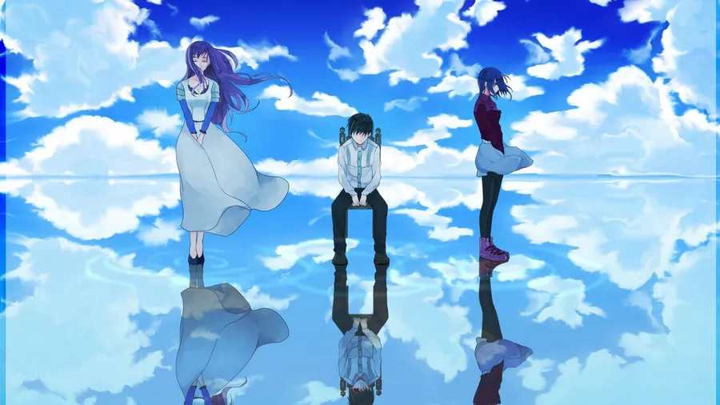

<!-- ══════════════════════════ CABEALHO ══════════════════════════ -->

  

  

 

<!-- ══════════════════════════ NAVEGAÇÃO ══════════════════════════ -->

  
  
  
  
  

---

## 🧬 SOBRE MIM

  <table>
    <tr>
      <td width="35%">
        
      </td>
      <td valign="top">
        <h3>👋 Olá, eu sou o João Vitor</h3>
        
Desenvolvedor Full-Stack especializado em criar soluções digitais imersivas, com foco em <b>experiência do usuário</b> e <b>performance</b>. Transformo conceitos complexos em interfaces elegantes e sistemas robustos.

        
🎯 <b>Foco atual:</b> interfaces cinematográficas e sistemas web completos

        
🌱 <b>Aprendendo:</b> TypeScript, Next.js e Docker

        
🎮 <b>Fora do código:</b> gamer de plantão, música e lore de animes

        
⚡ <b>Lema:</b> "A excelência está nos detalhes que ninguém percebe."

      </td>
    </tr>
  </table>

---

## ⚡ HABILIDADES

  <h3>🎨 Front-end</h3>
  
  
  
  
  

  <h3>⚙️ Back-end & Banco de Dados</h3>
  
  
  
  

  <h3>🛠️ Ferramentas</h3>
  
  
  
  
  

---

## 📁 PROJETOS EM DESTAQUE

<table>
  <tr>
    <td width="50%" valign="top">
      <h3>💰 Controle Financeiro 2.0</h3>
      
Sistema web para organização de finanças pessoais, com registro de gastos, metas e visão geral do orçamento.

      

        
        
        
      

      

        
      

    </td>
    <td width="50%" valign="top">
      <h3>💉 Studio Tattoo Alisson</h3>
      
Site portfólio para estúdio de tatuagem, com galeria de trabalhos e apresentação profissional do artista.

      

        
        
      

      

        
        
      

    </td>
  </tr>
  <tr>
    <td width="50%" valign="top">
      <h3>🩸 Site Temático Kaneki</h3>
      
Experiência imersiva no universo de Tokyo Ghoul: fichas de personagens, trilha sonora, vídeos e visual cinematográfico.

      

        
        
        
      

      

        
        
      

    </td>
    <td width="50%" valign="top">
      <h3>📦 Supplies Locação</h3>
      
Site comercial para locação de equipamentos e supplies, com catálogo de máquinas e identidade visual própria.

      

        
        
      

      

        
        
      

    </td>
  </tr>
</table>

---

## 📊 ESTATÍSTICAS

  

<!-- Gráfico de contribuições (serviço estável, não depende de Vercel) -->

  

<!-- OPCIONAL: animação da cobrinha. Só descomente depois de gerar em https://github.com/Platane/snk

  

-->

---

## 📬 CONTATO

  
  
  
  
  

---

<!-- ══════════════════════════ RODAPÉ ══════════════════════════ -->

  
    
  
"O verdadeiro poder está em criar soluções que transcendem as expectativas."

  
— João Vitor

   
  <h3 style="color:#c41e1e; letter-spacing:0.2em;">喰 • JOÃO VITOR © 2026 • 喰</h3>
   
  <a href="#top">⬆ Voltar ao topo</a>

